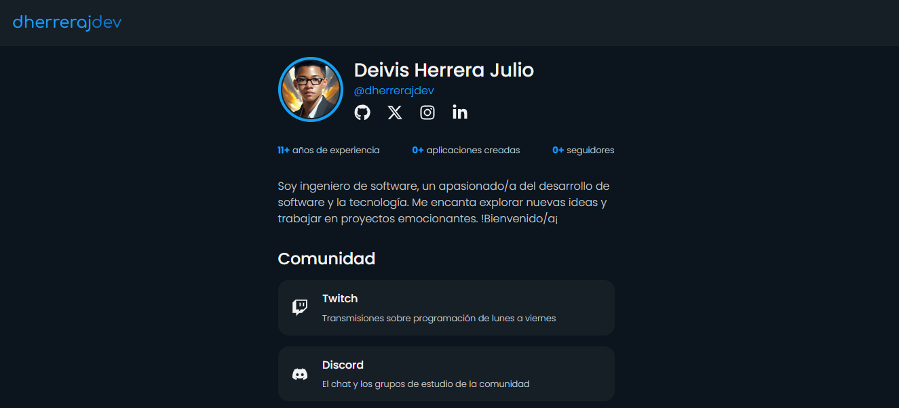

# Website de links de DHerreraJDev

## Proyecto desarrollado con [Python](https://www.python.org/) y [Reflex](https://reflex.dev/) que representa un sitio web personal estilo "[link in bio](https://dherrerajdev.netlify.app)"

